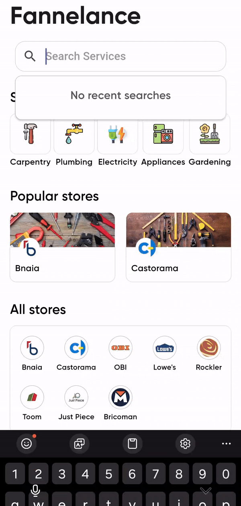

<section id="fannelance-app" align="center">
  
  <h1>Fannelance App</h1>
</section>

## Welcoming

Welcome to the Fannelance App! This app is designed to help you quickly find and connect with the nearest skilled workers in your area to address your fannelance needs.

## Running App

<section id="screens">
  
  
  
  
  
  
  
</section>

## Features

- **Find Nearby Workers**: Locate the nearest available workers based on your current location.
- **Worker Preview**: View detailed preview of workers, including their skills, ratings, and reviews.
- **Request Services**: Easily request a services by specifying the issue and selecting a worker.
- **Real-Time Request**: Get real-time requests on the worker's location as they travel to your site.
- **Phone Number Verification**: Securely verify your phone number using a one-time password (OTP) before creating your account.

## Upcomming Features

- **In-App Communication**: Chat with workers directly within the app to discuss details and updates.
- **Secure Payments**: Make secure payments directly through the app once the job is completed.

## Getting Started

### Prerequistes

- Ensure you have [Flutter]("https://docs.flutter.dev/get-started/install") installed on your device.
- A compatible Android device or emulator to run the app.

### Installation

1. Clone the repository:

```bash
  git clone https://github.com/Fannelance/User-Flutter-App.git
  cd User-Flutter-App
```

2. Install dependencies

```bash
  flutter pub get
```

3. Run the app on your perferred device:

```bash
  flutter run
```

## Usage

1. **Sign Up or Log In**: Create a new accoun or log in with your existing credentials.
2. **Set Your Location**: Allow the app to access your location to find nearby workers.
3. **Browse Workers**: View available workers, their skills, and ratings.
4. **Request Service**: Choose a worker and describe your maitenance issue.
